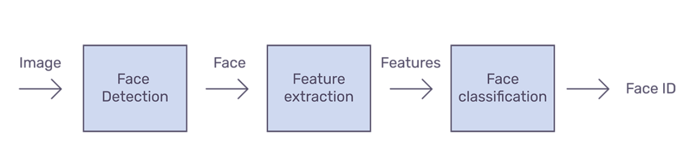
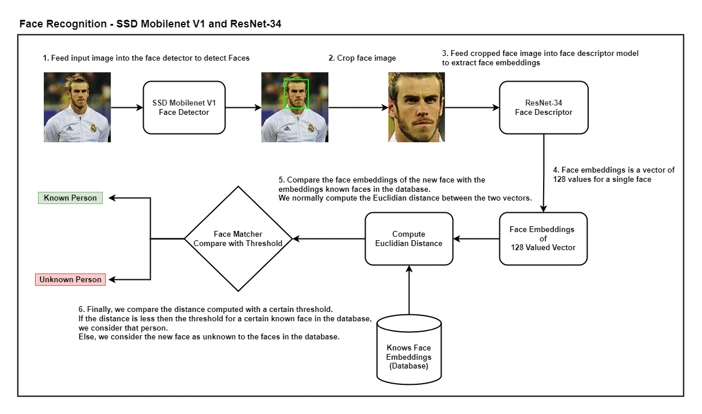

<div>
<h1>Face Recognition - MERN Stack Application</h1>
<br>

<div align="center">
  </a>
</div>

This repository represents a MERN stack application for face recognition authentication. The repo contains a sample front-end React JS application along with Node Js connected with Mongo DB in the backend. The React JS application has the capability to send request for registering a user, recognizing new user, deregistering a user and requesting to show all registered persons in the database.

## <div>General Capabilities</div>

* <b>Registering User:</b> User can be registered by entering the name/email and choosing its photo from the React app (Make sure the photo contains only user's face, not multiple faces). The React app sends the name and photo to the server where the server receives the image, process it and extract face embeddings using face-api. The face embeddings are then saved in the database with the name/email of the user. The server then sends a response back to the React app.


* <b>Deregister Person:</b> We can also deregister a person by entering its name from the database from the React app. The server then first checks if the person is registered already and remove it from the database. It then send a response back to the React app.

* <b>Show Registered Persons:</b> We can also send a get request from the React app to the server to show all registered persons in the database. The server sends an array of registered persons in the response to the React app.

## <div>Quick Start Examples</div>

<details open>
<summary><h3><b>Install and Run Node Js</b></h3></summary>

Before running below commands for installing packages, make sure C++ development kit is already installed. We can install C++ development kit through Visual Studio.

```bash
$ cd node-backend
$ npm install
$ nodemon start src/index.js
```

<summary><h3><b>Install and Run React JS</b></h3></summary>

```bash
$ cd react-frontend
$ npm install
$ npm start
```

The current back-end and front-end code was tested on Node version 14.15.1 and npm version 6.14.8.
</details>

## <div>How do Face Recognition Work?</div>
Formally, Face Recognition is defined as the problem of identifying or verifying faces in an image. How exactly do we recognise a face in an image?

Face recognition can be divided into multiple steps. The image below shows an example of a face recognition pipeline.

<div align="center">
  </a>
</div>

1. **Face detection —** Detecting one or more faces in an image.
2. **Feature extraction —** Extracting the most important features from an image of the face.
3. **Face classification —** Classifying the face based on extracted features.

There are various ways to implement each of the steps in a face recognition pipeline. This repo implements face-api (see refrences) which focuses on popular deep learning approaches where we perform face detection using SSD Mobilenet V1. We perform feature extraction using ResNet-34 like architecture and is equivalent to the FaceRecognizerNet and Dlib. Finally, we perform classification by computing Euclidian distance and comparing it to a certain threshold defined.

Please see the detailed flow of an image flowing through the pipeline for face recognition.

<div align="center">
  </a>
</div>

## <div>Author</div>

Muhammad Nouman Ahsan

## <div>References</div>

* face-api.js https://github.com/justadudewhohacks/face-api.js/

* face-recognition.js https://github.com/justadudewhohacks/face-recognition.js

* WIDER FACE: A Face Detection Benchmark http://shuoyang1213.me/WIDERFACE/

* dlib https://github.com/davisking/dlib