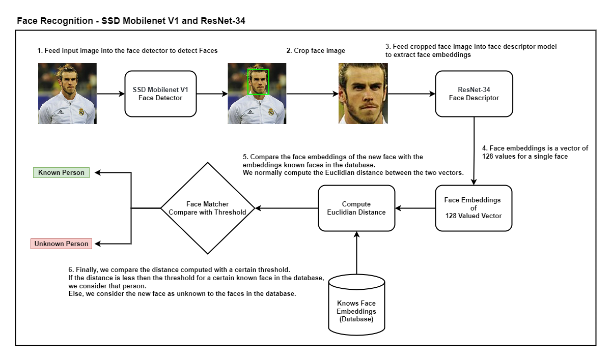

<div>
<h1>Face Recognition - Node JS</h1>

<div align="center">
  </a>
</div>

This repository represents the backend Node JS implimentation for the MERN stack face recognition application.

## <div>Quick Start Examples</div>
<details open>
<summary><h3><b>Install and Run Node Js</b></h3></summary>

Before running below commands for installing packages, make sure C++ development kit is already installed. We can install C++ development kit through Visual Studio. Also install MongoDB from their official website.

```bash
$ cd node-backend
$ npm install
$ nodemon start src/index.js
```
## <div>How do Face Recognition Work?</div>
Formally, Face Recognition is defined as the problem of identifying or verifying faces in an image. How exactly do we recognise a face in an image?

Face recognition can be divided into multiple steps. The image below shows an example of a face recognition pipeline.

<div align="center">
  </a>
</div>

1. **Face detection —** Detecting one or more faces in an image.
2. **Feature extraction —** Extracting the most important features from an image of the face.
3. **Face classification —** Classifying the face based on extracted features.

There are various ways to implement each of the steps in a face recognition pipeline. This repo implements face-api (see refrences) which focuses on popular deep learning approaches where we perform face detection using SSD Mobilenet V1. We perform feature extraction using ResNet-34 like architecture and is equivalent to the FaceRecognizerNet and Dlib. Finally, we perform classification by computing Euclidian distance and comparing it to a certain threshold defined.

Please see the detailed flow of an image flowing through the pipeline for face recognition.

<div align="center">
  </a>
</div>

</details>

## <div>Author</div>
Muhammad Nouman Ahsan

## <div>References</div>
* face-api.js https://github.com/justadudewhohacks/face-api.js/

* face-recognition.js https://github.com/justadudewhohacks/face-recognition.js

* WIDER FACE: A Face Detection Benchmark http://shuoyang1213.me/WIDERFACE/

* dlib https://github.com/davisking/dlib